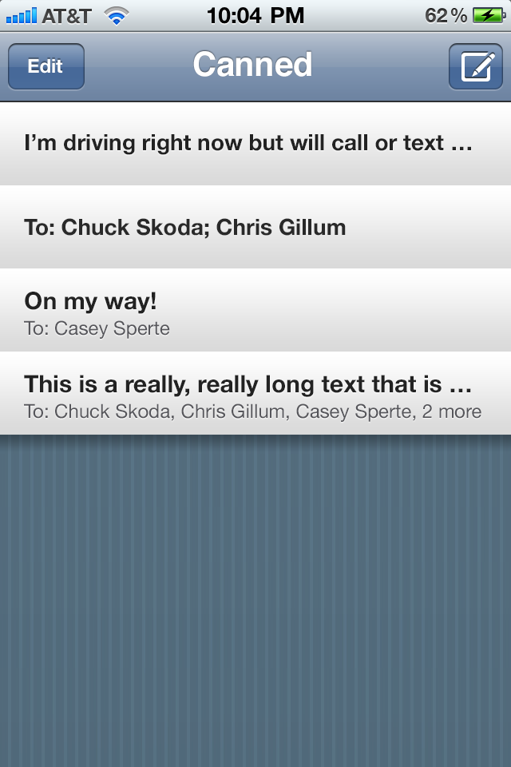
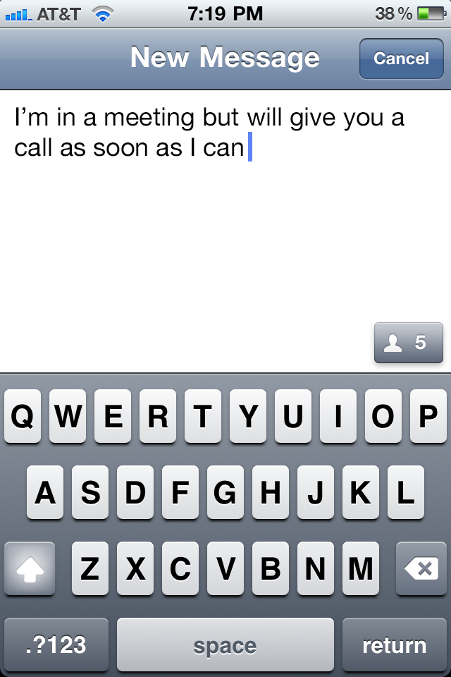
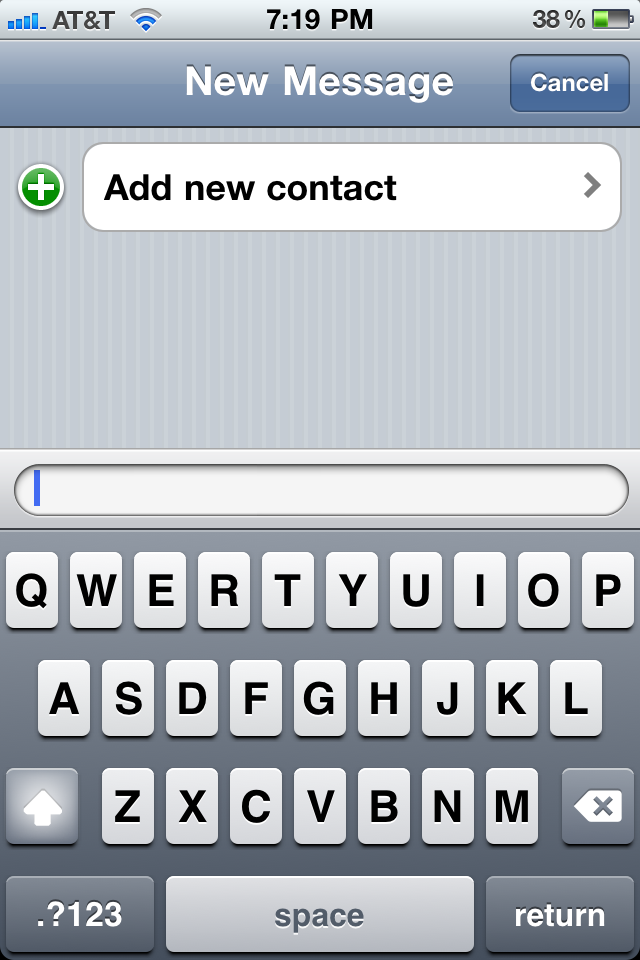
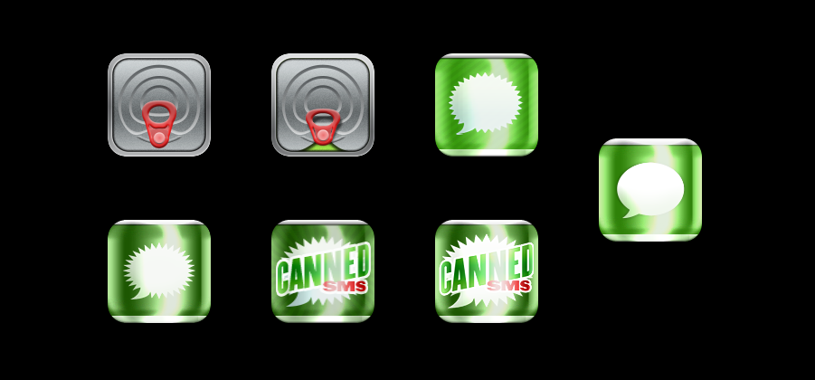

# Canned

Tapping out the same text message multiple times for multiple people can be cumbersome, but I knew it didn't have to be that way...

## Launch, tap, send

I worked with the small, 3-man Sky Balloon team to create an iPhone app that gave the ability to quickly send pre-drafted texts. The app also included a feature for sending to a preset person or group of people -- and since the draft template could be blank, the app was also used for group messaging.

  
  
  
  

The goal was to remove as much friction as possible from the process of sending a common text messages. I imagined an optimized user experience that could safely be used with one hand while driving.

We had to work within the confines of the capabilities of the OS and devkit, which meant we had to compromise on some of the things we wanted to do. For instance, the app couldn't send the text itself, instead we had to send the text to the Messages app and prompt the user to hit "Send". (It wasn't until later that Apple introduced the text message sheet view that allowed developers to at least provide a UX that didn't leave their app.)

## Just because we can

When we released Canned it was the height of skeuomorphism in mobile UI design. Anyway, I guess that explains why, after trying a couple of different takes on the "canned" metaphor, I ultimately landed on the most simple: canning the default Messages icon.

Canned ended up selling to a few thousand people and spawning a new trend in single-purpose, utilitarian type apps (and ripoffs). We would later create an email version of it called Canned Mail.

