**Type**: Web, creative production, video  
**Role**: Designer, Web Director  
**Tasks**: Web design, print design, digital design (including presentations), video effects editing, video editing, etc.

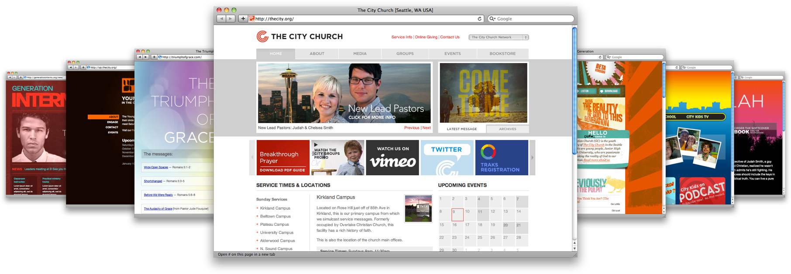

The City Church (now Churchome) is a non-denominational Christian church with thousands of weekly attenders across multiple locations/campuses. I worked there from 2000 to 2011, starting as an intern and working my way up to Director.

My responsibilities were very broad and shifted throughout my tenure. I designed print and digital graphics, designed and built various evergreen and campaign websites, created and maintained both audio and video podcast channels, managed social media profiles, created and edited video and video graphics, and designed and operated video production systems. In many of these capacities, I also led volunteer and intern personnel, and managed external vendor relationships.

  <a href="gospelpower.png" title="Promo and title slide for sermon series">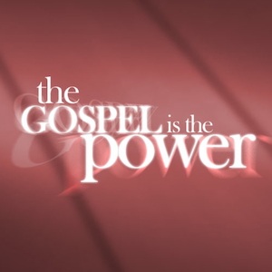</a>
  
  <a href="foundationsofparenting.jpg" title="Promo graphic for teaching series">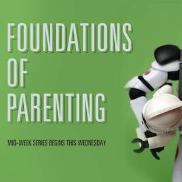</a>
  <a href="visionday.jpg" title="Promo graphic for special event">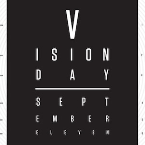</a>
  <a href="gccamp2002.png" title="Promo image for church youth camp">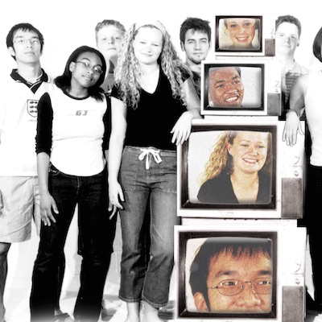</a>
  
  <a href="gracegrowsthechurch.jpg" title="Promo and title slide for sermon series">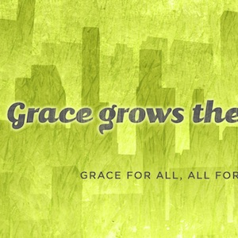</a>
  <a href="embracegrace.jpg" title="Brand and title slide for special event">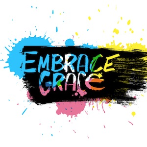</a>
  <a href="cometome.jpg" title="Promo and title slide for sermon series">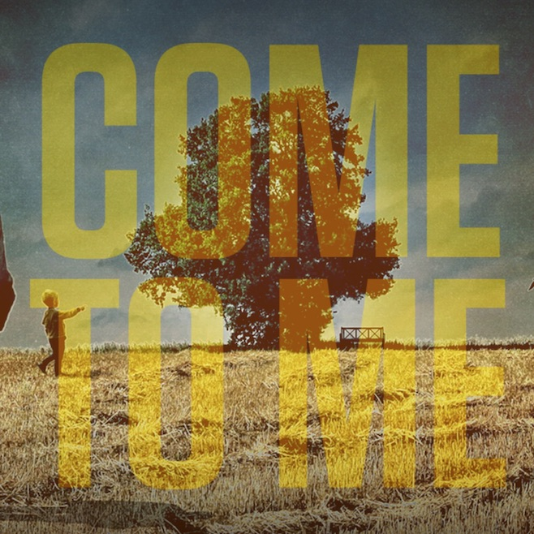</a>
  <a href="riskybusiness.jpg" title="Promo and title slide for sermon series">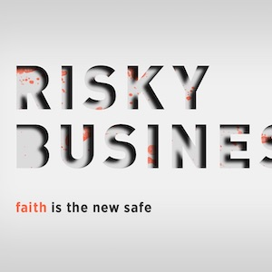</a>
  
  <a href="fourdaysdead.jpg" title="Promo and title slide for sermon series">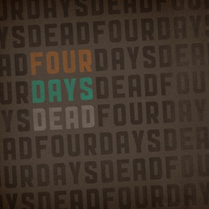</a>
  <a href="savingsamson.jpg" title="Promo and title slide for sermon series">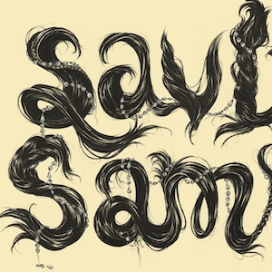</a>
  <a href="originalfreedom.jpg" title="Promo and title slide for sermon series">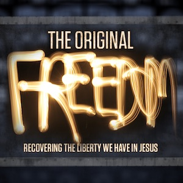</a>
  <a href="onegenerationtoanother.jpg" title="Promo and title slide for special event">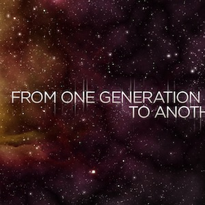</a>
  

As part of my primary responsibilities as Web Director, I helped transition the various organization websites to using Web Standards and promote progressive technologies and trends. The web and online media channels became very popular, even outside our core constituency:

- 25,000 podcast listeners
- 12,000 ‘visits’ per week (30,000 pageviews)
- 3.5TB of content downloaded per month
- 30-35% new visitors per week
- Average visit of 2.5 minutes
- High PageRank (first listing for “city church”)

The church is where I honed both my hard and soft skills, learned how to work well under pressure with little structure, and built out a strong set of operating values.
