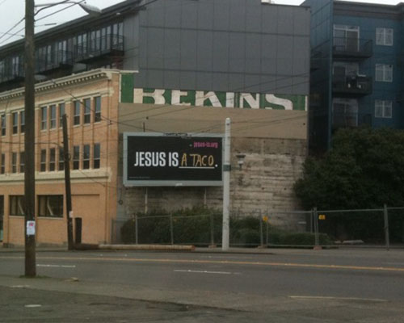

# JESUS IS ____

"Let's get people to talk about Jesus in Seattle" was the directive that came down from my pastor and boss at The City Church. That was it. There was little more to go off of, and no other goal(s).

## Inviting a conversation

The first thing to do was figure out how to invite a conversation without offending. After the bold suggestion of literally just using "JESUS" as the conversation starter ([a la Jim Gaffigan](https://www.youtube.com/watch?v=2k_9mXpNdgU)), I came up with the idea of adding a blank, and inviting people to fill it in. "JESUS IS ____" was born.

I can't take credit for the timeless composition of the logotype but did help select the typeface and provide feedback on the sizing and layout.

  
  

## A customizable answer

I instinctively knew that pouring resources into a marketing blitz would be in vain, so I suggested we create a call to action to actually, yanno, fill in the blank... on a website.

After a couple of quick design iterations, I landed on a tiled presentation, where each answer (fill-in) would be its own tile, and have either a randomized or customized background. The goal was to show how different people's opinions are, but how beautiful they can be when combined.

  
  

Because the site invited answers from anyone, I also built a moderation and approval mechanism and workflow for someone to monitor. As you can imagine, that wasn't always an easy job, particularly when the community on 4chan got wind of the site.

One of the coolest aspects of the site was the homepage, which selected from the pool of approved answers and randomly rotated them through 11 spots -- with one kept empty, inviting the visitor to answer for themselves.

  
  
  

The site received over 160,000 submissions and is still going today, as is the JESUS IS ____ brand.
