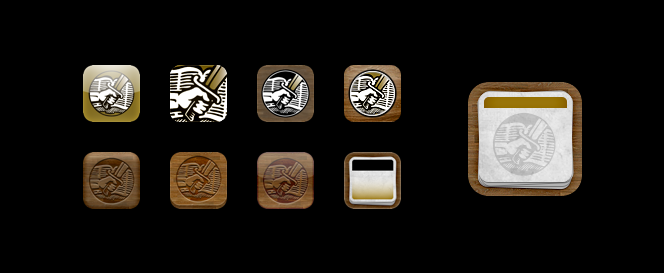
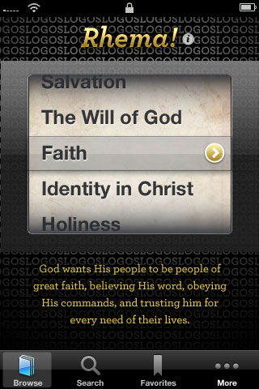
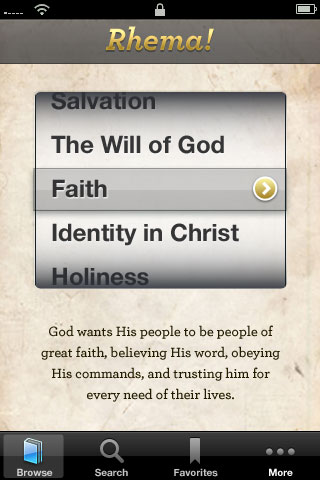
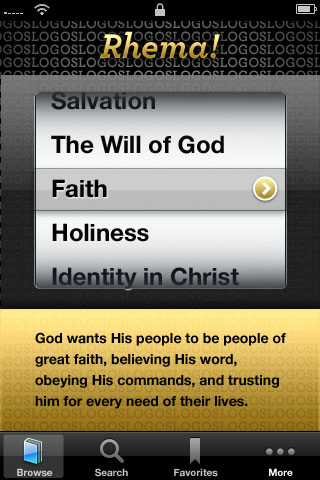
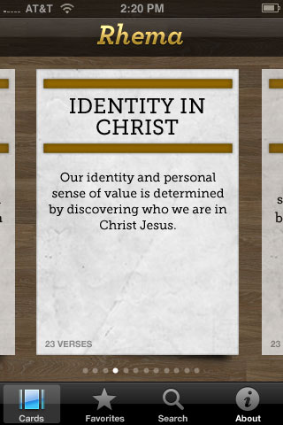
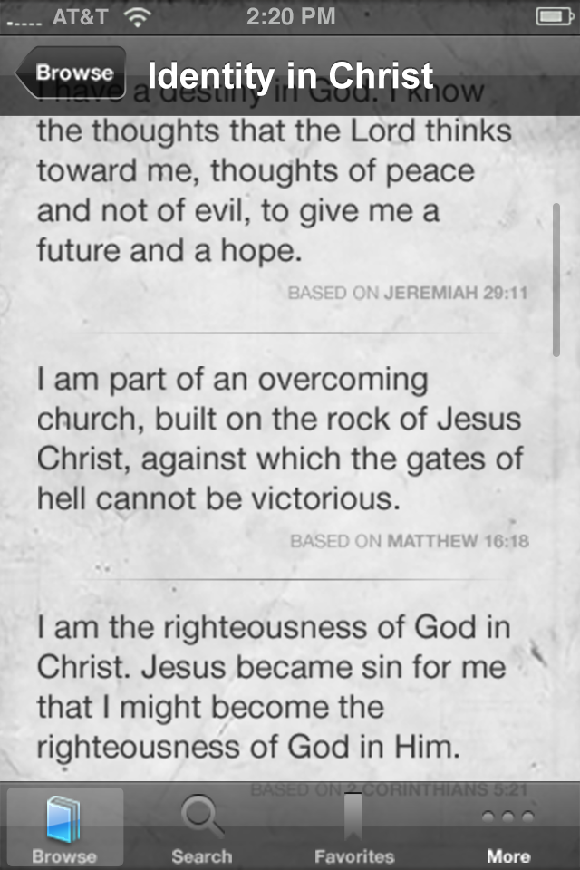

**Type**: Mobile app; marketing site  
**Role**: Lead designer; web developer  
**Tasks**: UX/UI design, visual design, front-end (web) development, marketing

## Personalized scripture in your pocket

Me and two others took on designing and building a Rhema card iPhone app. We weren't sure if it was something others would want, but we did -- and we wanted to hone our skills for creating mobile apps.

  
  
  
  

I started off by brainstorming what the user experience should be, and eventually landed on a digital workflow borrowing heavily from the "card" metaphor. For the UI and visual treatment I probably went overboard with skeuomorphic textures and effects.

## Iconic references

I had opinionated preference for how iPhone app icons should look, so I took great care and time in creating the Rhema app icon.

The original Rhema cards had an emblem as part of the masthead that had -- along with the colors and typography -- become a sort of the brand. I didn't want to depart too much from this established aesthetic, so I attempted to integrate the emblem into the icon with varying degrees of success across iterations.

I finally landed on an icon that both honored the past, but also looked and felt great on the iPhone's digital screen.

## An instant classic

After we published the app to the App Store (for free) word quickly spread about its existence. Our small team of three was taken aback by its almost-immediate cultural success and relevance -- at least in our small circles. It became, as we were told, a must-have homepage app for our church community.
