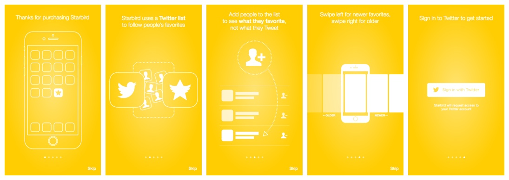
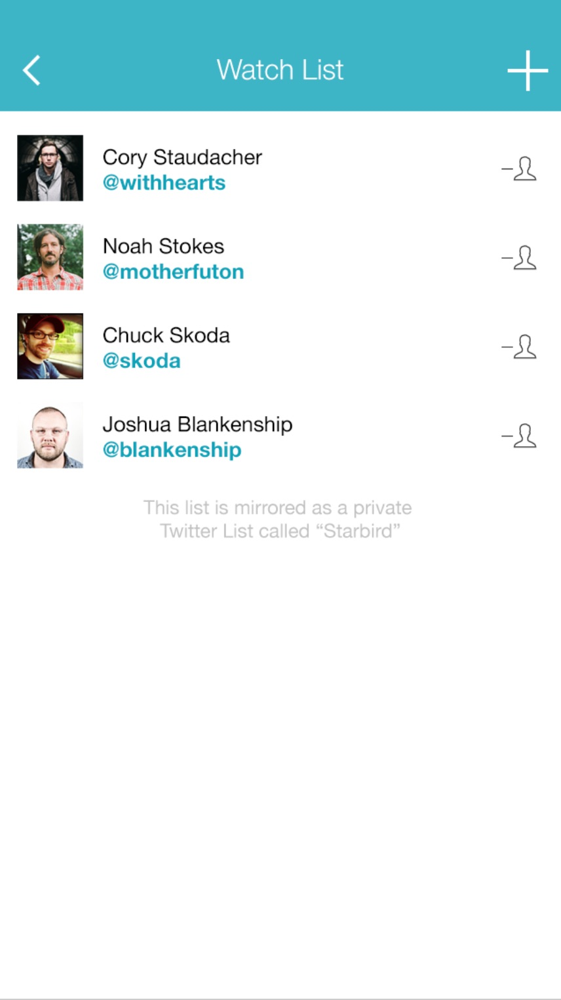
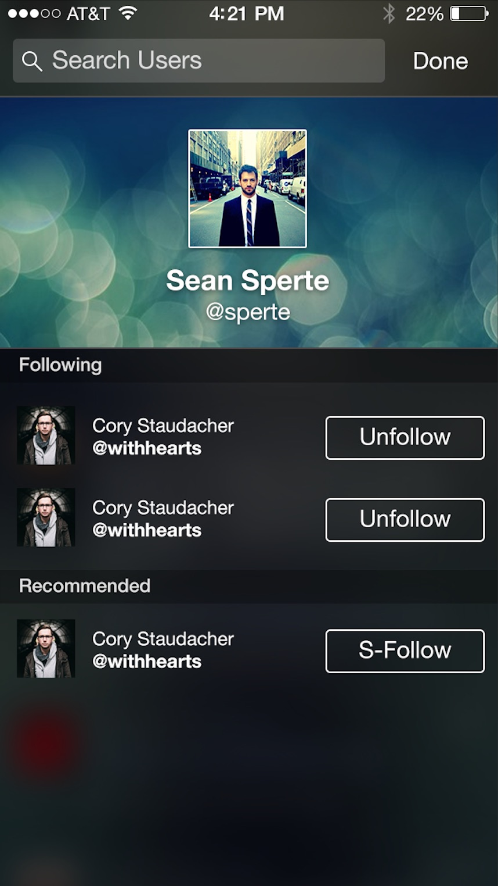
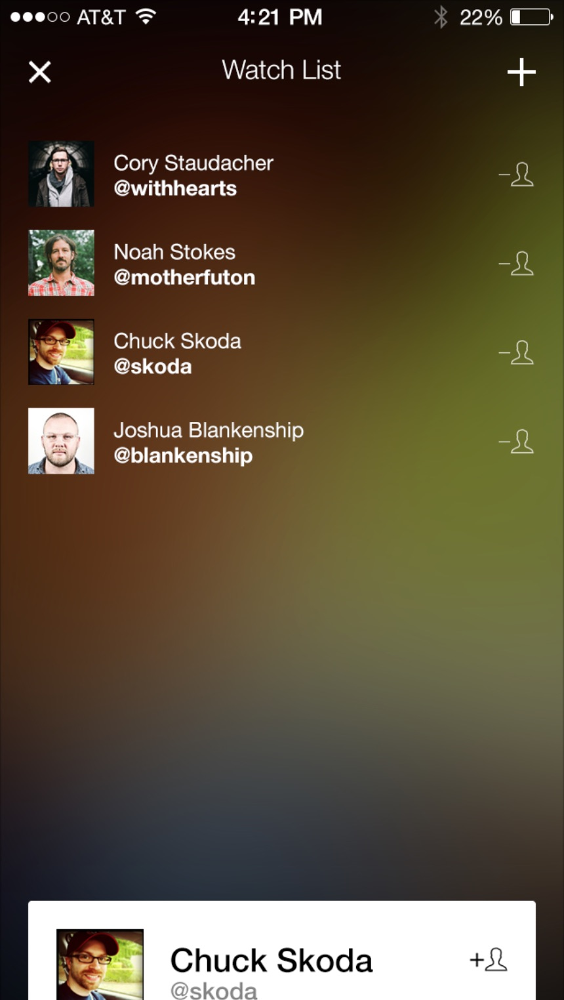
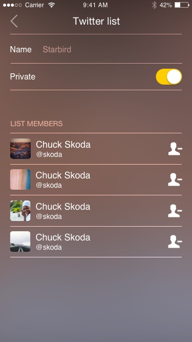
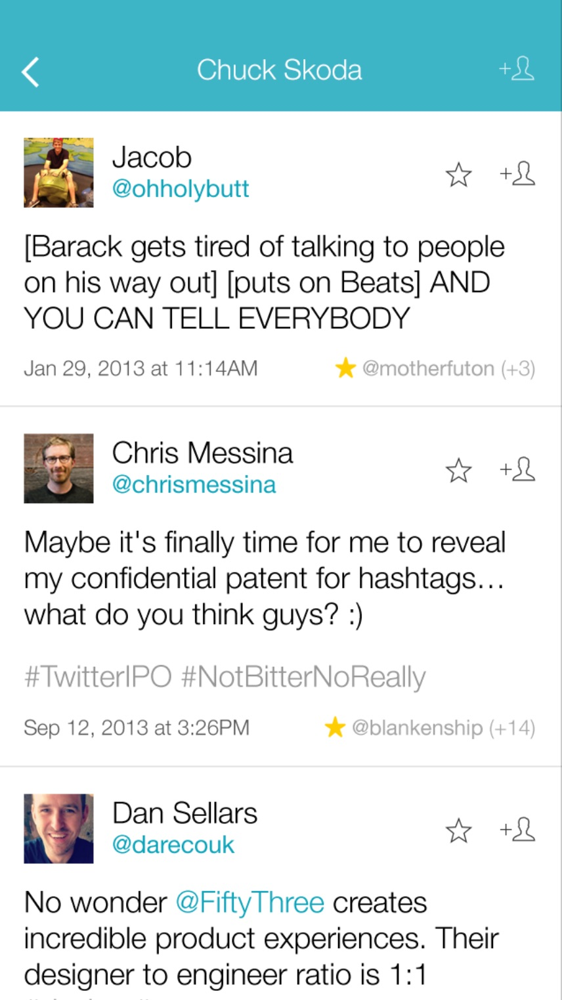
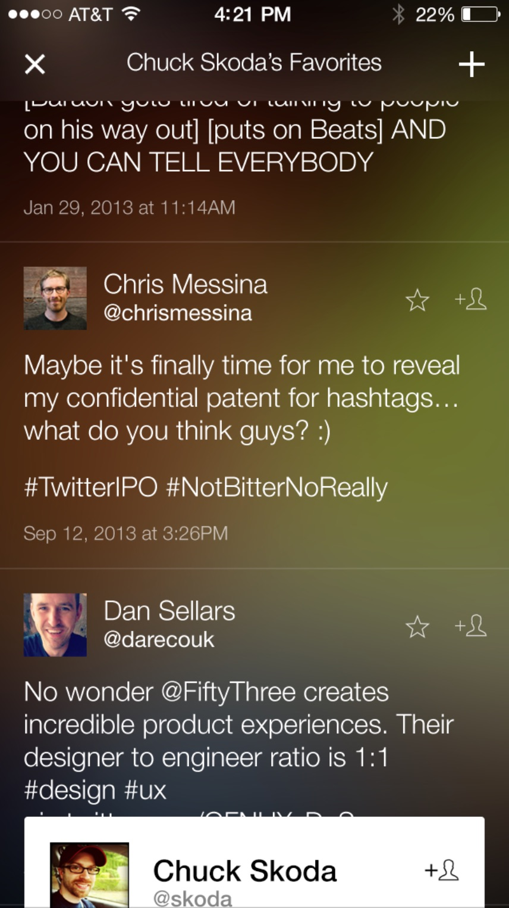
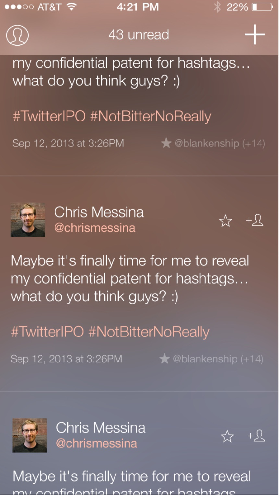
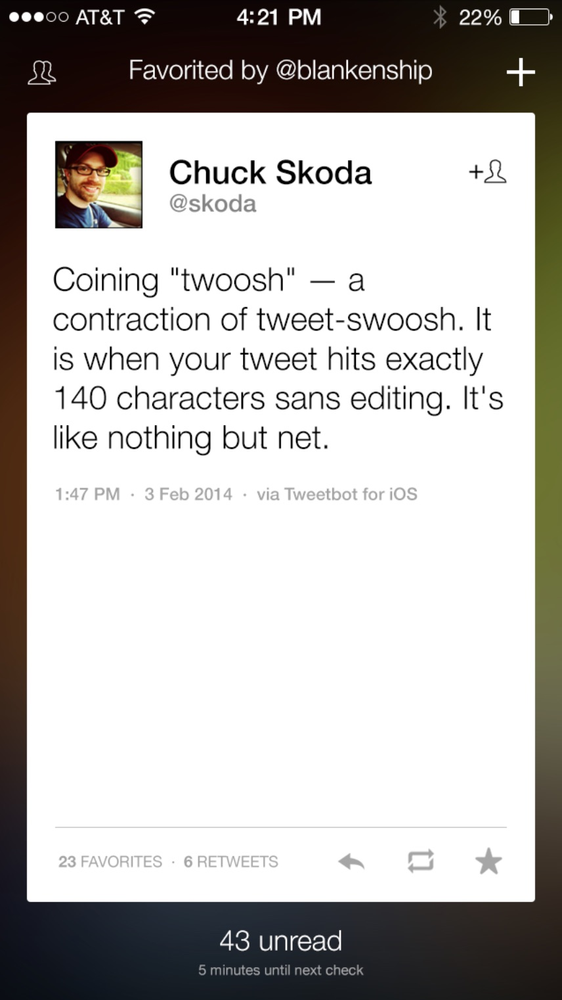
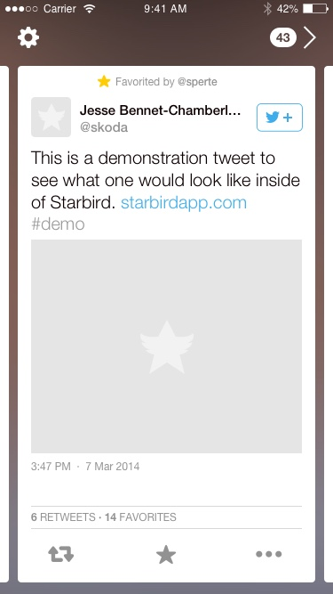

**Type**: Mobile app; marketing site  
**Role**: Lead designer; web developer  
**Tasks**: UX/UI design, visual design, front-end (web) development, marketing

## Surfacing the best of Twitter, one tweet at a time

At some point keeping up with our Twitter timelines became untenable. The ratio of signal to noise was getting lower and lower, and Twitter hadn't yet been able to fix the problem with algorithms. That's when I had an idea: what if we could follow people's _favorites_ instead of their tweets?

Starbird allowed you to set up a secondary 'follow' list of people who's favorites would show, rather than their tweets. There were two primary challenges with building the app:

1. The limitations with the Twitter API
2. Designing the right UI/UX

The limitations of the API were something I had to keep in mind as the designer, but I left the solutions up to to the developers I worked with. They found a way: using Twitter Lists.

  
  
  
  

The UI/UX design challenges were my responsibility. I iterated on a couple of timeline experiences...

  
  
  
  

... but quickly pivoted after recognizing this app was to be an augment-not-replacement to the core Twitter experience. Because I felt in this experience every tweet should be worthy of consideration, I decided to design a view that featured only a single tweet at a time -- with a card-like UX.

We were close to a code and feature complete MVP when we decided to abandon the app. The limitations of the Twitter API, along with the volatile developer ecosystem, made us uncomfortable about the future sustainability of app.
