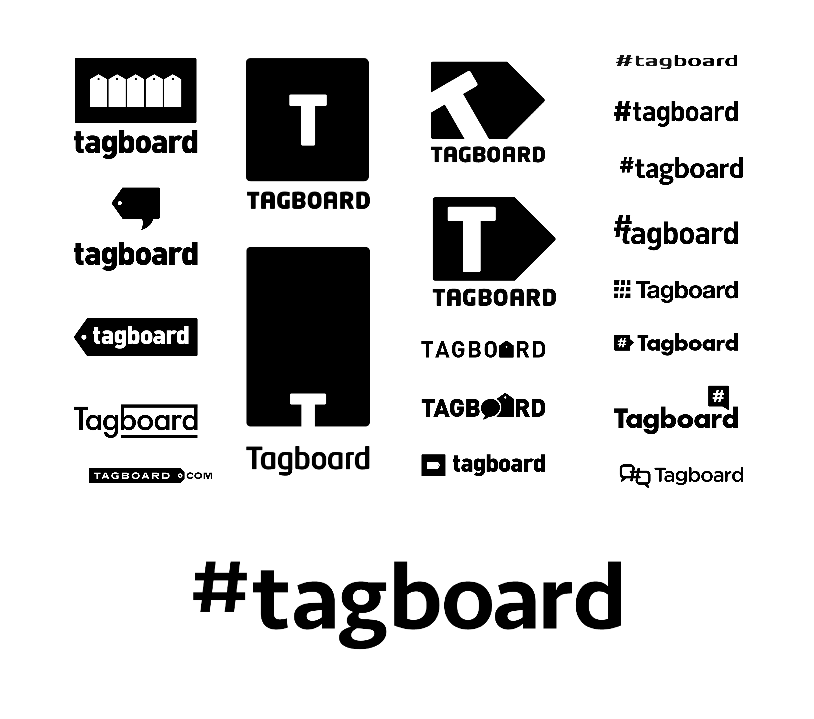
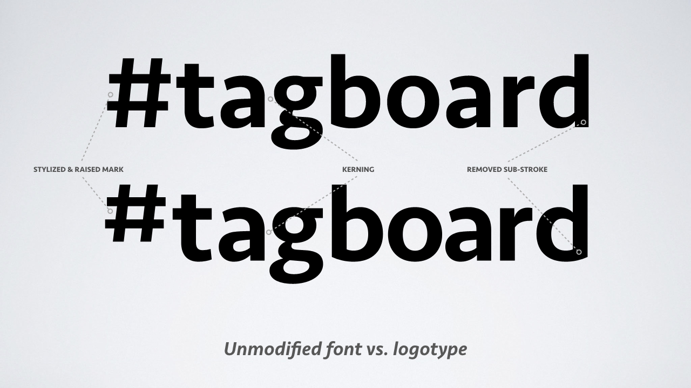
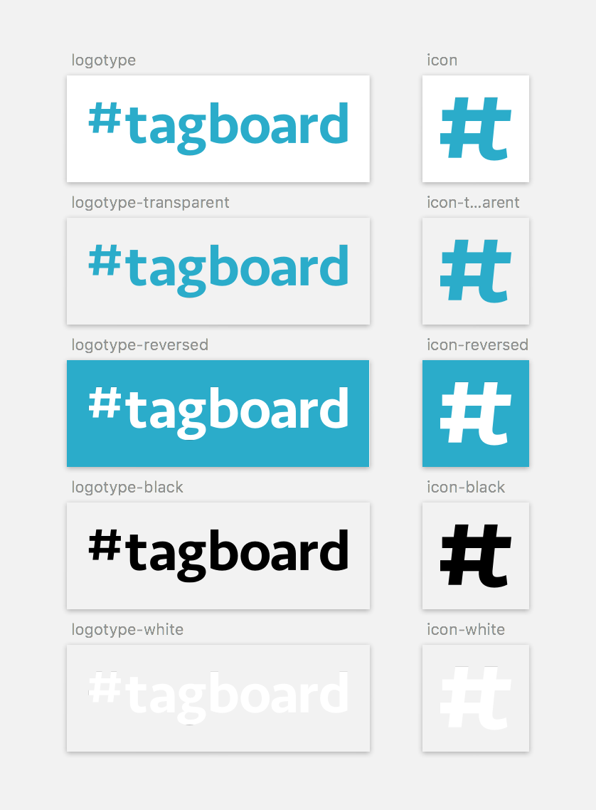
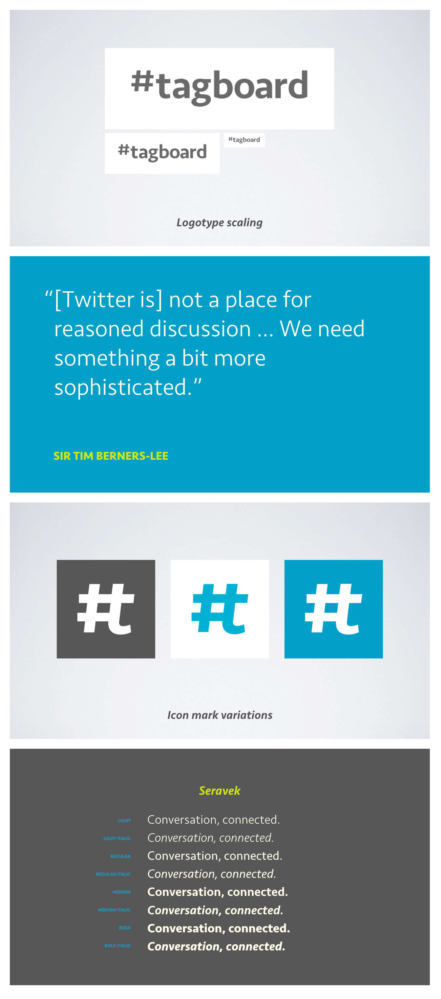
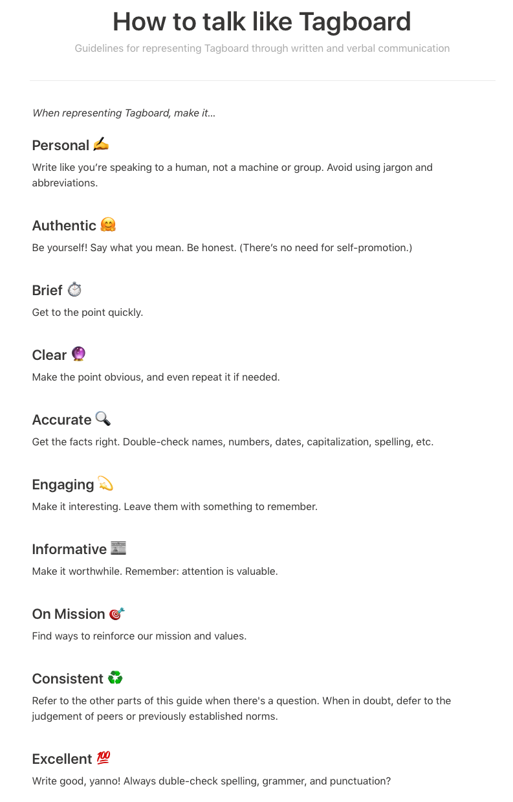
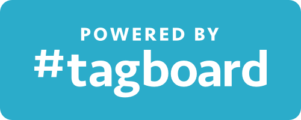
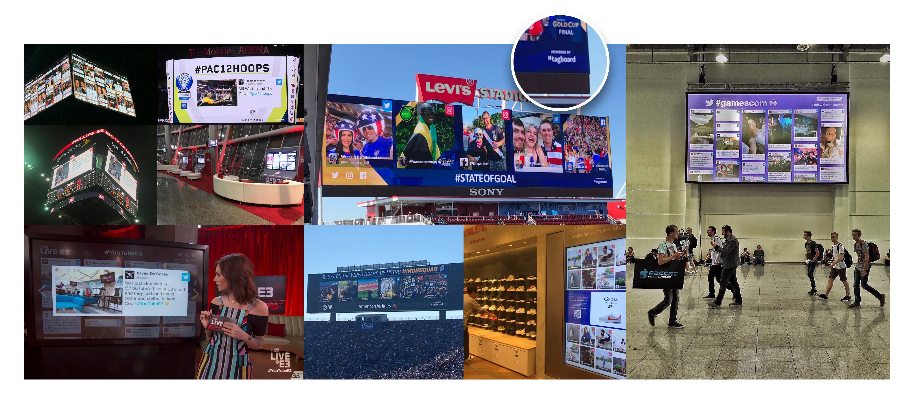

**Type**: Visual identity, stye guide  
**Role**: Principle  
**Tasks**: Visual design, brand design

## Type, face, and mark

As the design co-founder of a social media company, I was responsible for establishing the brand &mdash; the visual identity and the voice.

Research started months earlier. Because we had no customer base to survey or study, I audited the technology industry, mostly from consumer brands and companies. I knew I wanted to create a simple brand that included the name in the logo -- a logotype -- but also recognized the need to have a strong mark that would double as the app's icon. It had to be both distinctive and timeless, so I avoided the temptation to use current trends: gradients, overlaps, and simple shapes.

After test driving dozens of typefaces, I landed on [Seravek](https://processtypefoundry.com/fonts/seravek/), from the same foundry as the Facebook font, [Klavika](https://processtypefoundry.com/fonts/klavika/). It satisfied the requirements of being familiar and friendly but was also customizable and felt high-brow. I used it to set our company name, then modified it to have unique character qualities.

I also created a mark that integrated the hash symbol (#) and Seravek's lowercase "T". It would later become our app icon, serve as our website favicon, and be used as a watermark for on-air attribution.

## Color codified

As part of my research, I also looked into color cognition and response. I knew color is an extremely important part of establishing a lasting and strong brand, and I determined although the blue-green spectrum of the wheel was overcrowded, breaking convention just for the sake of being unique wasn't wise, especially given the type of emotional reactions we wanted to engage -- things like friendliness, accessibility, ease of use, etc.

I created a base color scheme that included primary and secondary/accent colors that translated well across (most) mediums.

## Getting the brand back together

As part of the process I developed a slide deck to help communicate the brand story. Later, I expanded and migrated the presentation to include things like communication policies and non-visual elements.

The logotype was also integrated into an attribution badge to help viewers identify Tagboard's public screens. The badge became an important part of our partnership strategy with source networks like Twitter and Facebook: if a public social screen had our logo, it meant the display was licensed. And despite early push-back from customers, the "Powered by Tagboard" badge eventually became a sort of badge of honor, signaling a sanctioned (and high-quality) social display.

