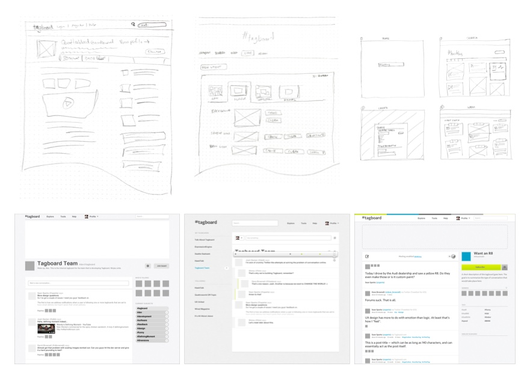

**Type**: Product MVP/prototype; marketing site  
**Role**: Principle  
**Tasks**: UX design, web design, front-end (web) development

## From sketch to ship

It's been said that the first step is the hardest of all. That was true of Tagboard in its early months. We'd been spinning our wheels, stuck in brainstorming meetings and discussion threads.

As the design co-founder, I took it upon myself to begin sketching some basic app layouts based on our current ideas. From there I used Photoshop to create low-fidelity mockups, but quickly transitioned to experimenting in code -- adding styling and visual treatments along the way as necessary.

I used a CMS framework with which I was familiar (ExpressionEngine), and several third-party extensions and utilities -- some of which I had to hack and edit -- to get a working prototype built.

After that I continued to refine the interface until there was a consensus that the core experience was solid, then built out a simplified marketing site.

Tagboard would later become an essential piece of the social media ecosystem, providing a way for organizations to easily and safely display social media off its original platform, in branded experiences and in real-world venues.

